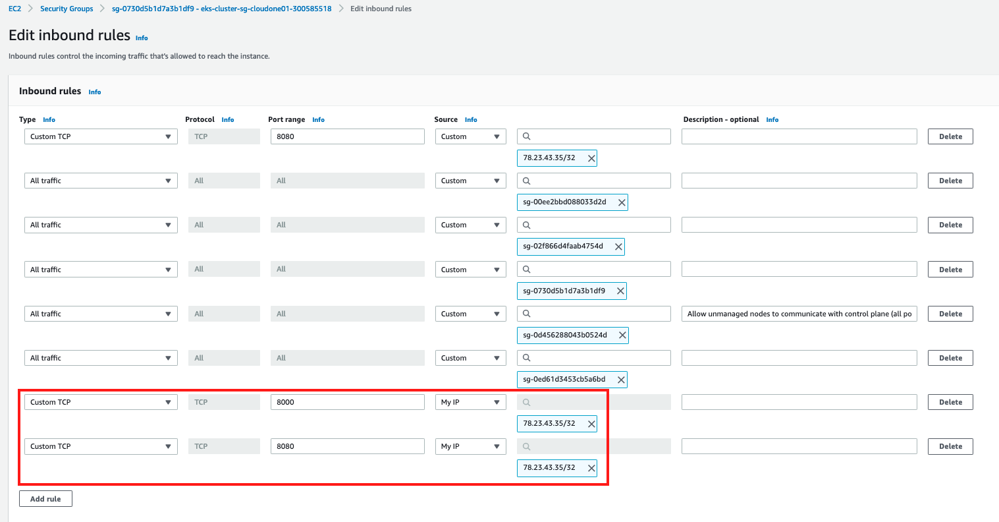
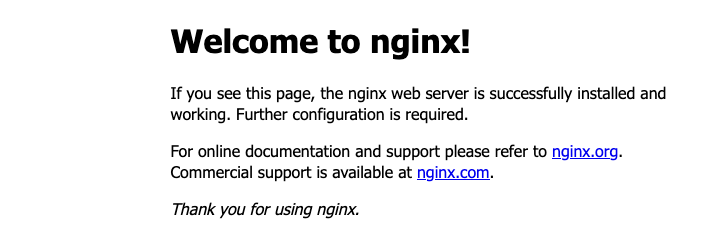
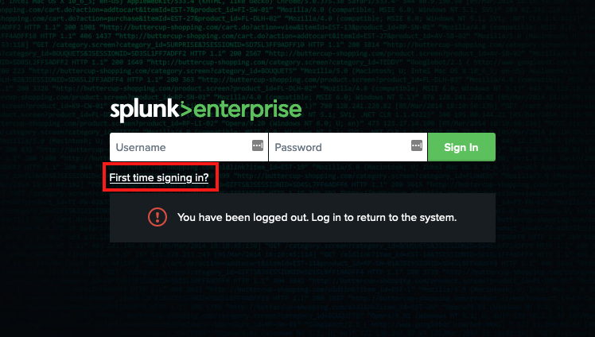

## run an nginx container  v
From your bash terminal, run an NGINX container and expose it at port 8080
```shell
docker container run -p 8080:80 -d nginx 
```
## test it:   
Find the public IP of your Cloud9 environment:  
Cloud9 environments are basically EC2instances.  So, go to AWS https://eu-central-1.console.aws.amazon.com  (you may have to change the region to the region where you started the Cloud9 environment) and find the EC2 instance that starts with "aws-cloud9-"   
Find its IP address at the bottom half of the page under *Details* -> *Instance summary*    
An easier way may be to run the following in your Cloud9 shell
```shell
myip="$(dig +short myip.opendns.com @resolver1.opendns.com)"
echo "My WAN/Public IP address: ${myip}"
```

In the Security Group for that EC2 instance, open port 8080 and port 8000 (for the next lab)   
For the `Source` select "My IP", not "anywhere"  
AWS Services -> ec2 -> select the EC2 instance of your cloud9 environment -> at the bottom part of the screen: open the `Security` tab -> click on the Security group -> Inbound Rules -> Edit inbound rules -> Add Rules  
`Save Rules`


From our workstation, browse to it:  `http://MY_IP:8080`  
  

Find the container-ID of that container  
```shell
docker ps  
```
Run an Alpine container
```shell
docker run -d alpine
docker ps
```

Why don't you see the Alpine container?  
try `docker ps -a`
```shell
docker ps -a
```
Can you explain what happened?

Find the images on your host
```shell
docker image ls
```

## Let's deploy Splunk  
Browse to https://hub.docker.com/ search for `splunk`  
Locate the image `splunk/splunk` and click on it
Scroll down to the "Quick Start" section and read it  
Now, let's deploy it locally.
For the password, use e.g. "Tr3ndm1cr0!"  

```shell
$ docker run -d -p 8000:8000 -e "SPLUNK_START_ARGS=--accept-license" -e "SPLUNK_PASSWORD=Tr3ndmicro!" --name splunk splunk/splunk:latest
```
Port 8000 should already be opened in the Security Group in the previous step.  
From your workstation, browse to it  
It will be on the same IP as the Nginx, but on port 8000
 


## Cleanup (optional)
Stop and delete all running containers
```shell
docker ps
docker stop [CONTAINER-ID]
docker rm [CONTAINER-ID] [CONTAINER-ID] [CONTAINER-ID] 
```
Delete the images that you have created earlierGjensidige
```shell
docker image ls
docker rmi [IMAGE-ID] [IMAGE-ID] [IMAGE-ID]
```
