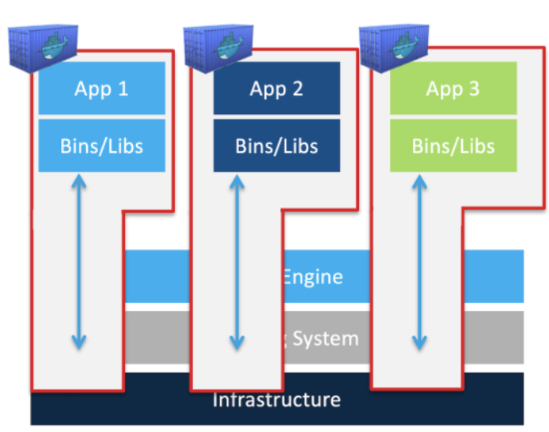
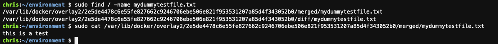
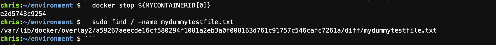
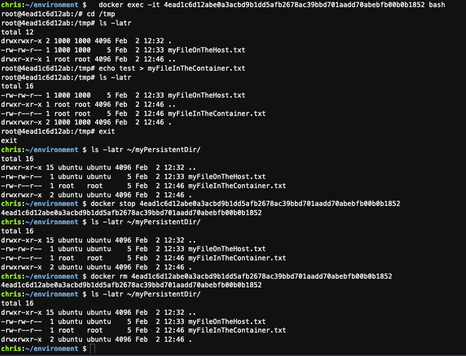

## Objectives
This lab shows that, unlike with _VMs_, files that are created inside a _Container_ are visible on the container host.  
  

## Start a container
From your bash terminal, run an NGINX container and expose it at port 8080
```shell
  docker container run -p 8080:80 -d nginx 
```
 
## Test 1: The filesystem in the container is carved-out of the filesystem of the host
###Find the ID of that container  
You can do "docker ps" and read the container-ID
Or, type the following commands to create a variable $MYCONTAINERID which will contain the ID of your nginx container.
```shell
  docker ps | grep -i nginx
  export MYCONTAINERID=(`docker ps | grep -i nginx | awk '{ print $1 }' `)
  echo ${MYCONTAINERID[0]}    
```

Login to that container  
```shell
  docker exec -it ${MYCONTAINERID[0]} bash
```
 
Still in the container, create a file.  Then exit the container.
```shell
  echo "this is a test" >> mydummytestfile.txt
  exit
```

Now on the host, search for that file:
```shell
sudo find / -name mydummytestfile.txt
```
 
You will see the file showing up on the host in one of the overlay directories.  The filesystem in the container is carved-out of the filesystem of the host  


## Test 2: If a container dies, its data is gone as well

### Stopping the container, deletes the files in "merged"
```shell
  docker stop ${MYCONTAINERID[0]} 
  sudo find / -name mydummytestfile.txt
```


### Deleting the container also removes the files in "diff"
```shell
  docker rm ${MYCONTAINERID[0]} 
  sudo find / -name mydummytestfile.txt
```


## Test 3: Enabling persistence
A way to ensure that data survives the container is by using "volumes" in docker  
Let's make a directory that we will use for persistent storage of our NGINX container
And create a file in it.

```shell
  mkdir ~/myPersistentDir
  echo "test" > ~/myPersistentDir/myFileOnTheHost.txt
```
  Start a new container, based on the same nginx image, but this time map `~/myPersistentDir` from the host to `/tmp` in the container
```shell
  docker run -v ~/myPersistentDir:/tmp -p 8080:80 -d nginx 
  docker exec -it [CONTAINER_ID] bash
```
  The file from the host is visible in the container

```shell
  ls -latr /tmp/myFileOnTheHost.txt  
```     
  Create a new file in the container and exit
 ```shell
  echo "test" > /tmp/myFileInTheContainer.txt
  exit
  ls -latr ~/myPersistentDir
```
The file has been created on the host in `~/myPersistentDir/myFileInTheContainer.txt`  
After stopping the container, the file is still there
 ```shell
    docker stop [CONTAINER_ID]
    ls -latr ~/myPersistentDir
 ```
And even after removing the container, the file is still there
 ```shell
    docker rm [CONTAINER_ID]
    ls -latr ~/myPersistentDir
 ```



## Test 4: Processes inside a container can be seen by the host
We just saw that _files_ from inside the container can be seen on the host.  Now let's take a look at the processes.  
On the host, run the following command to see if there are any `nginx` processes running. 
```
ps -ef | grep -i nginx
```
There are no nginx processes running on the host.  (if you see any nginx processes running; verify that all your nginx containers are stopped)  

Start an nginx container and verify that it is running
```shell
  docker run -v ~/myPersistentDir:/tmp -p 8080:80 -d nginx 
  docker ps
```
Check the host again for any running nginx processes
```
  ps -ef | grep -i nginx
```
What you are seeing are the nginx processes from the container  
To validate, stop the container and check for nginx processes again  
```
  docker ps                 # this will show the CONTAINER_ID
  docker stop  ONTAINER_ID  #replace CONTAINER_ID with ID of your container
  ps -ef | grep -i nginx    
```
And, again, the nginx processed have dissapeared 


