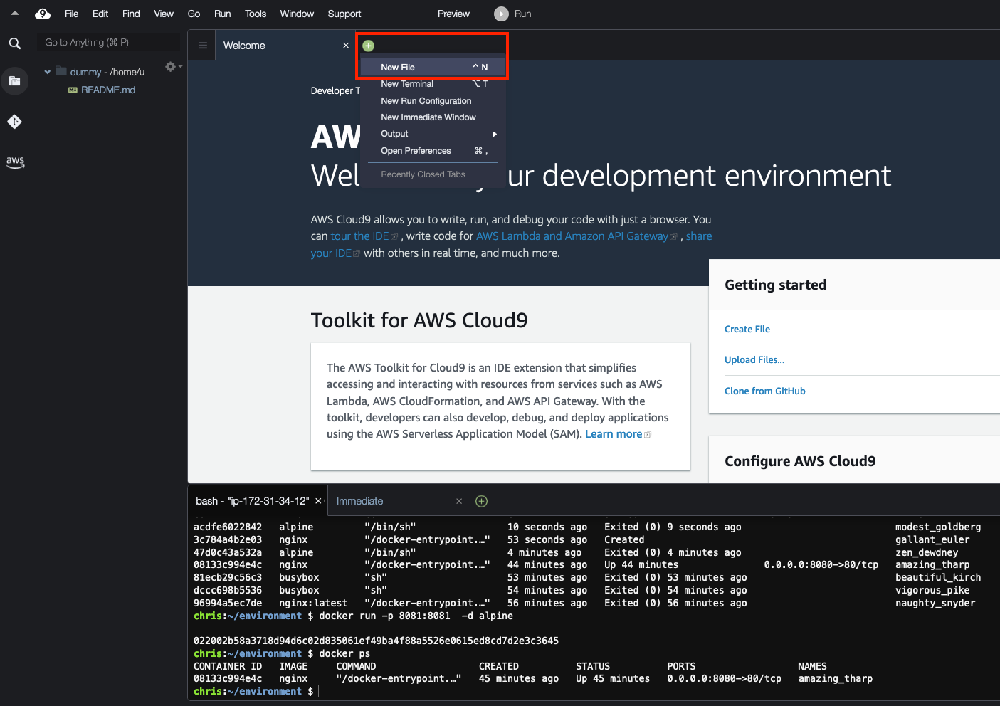
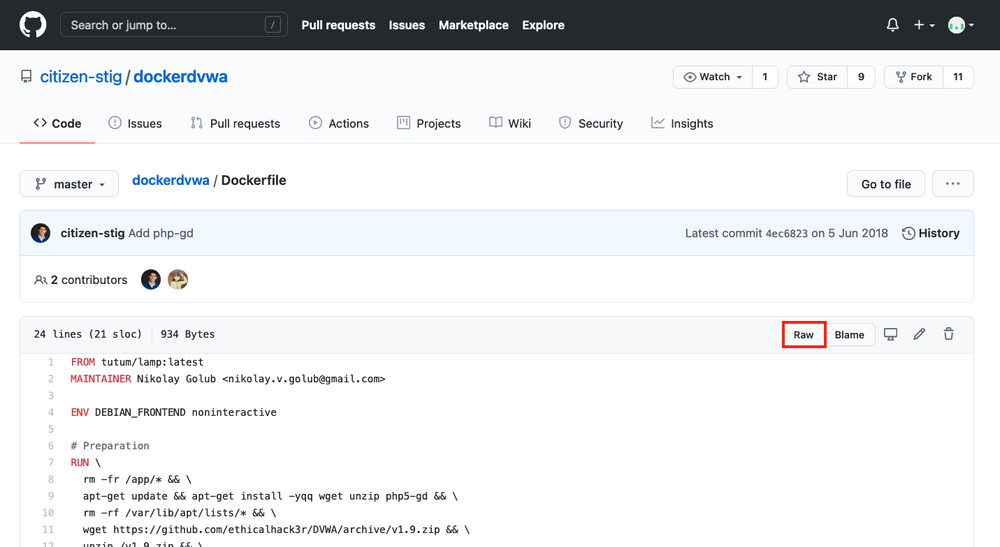
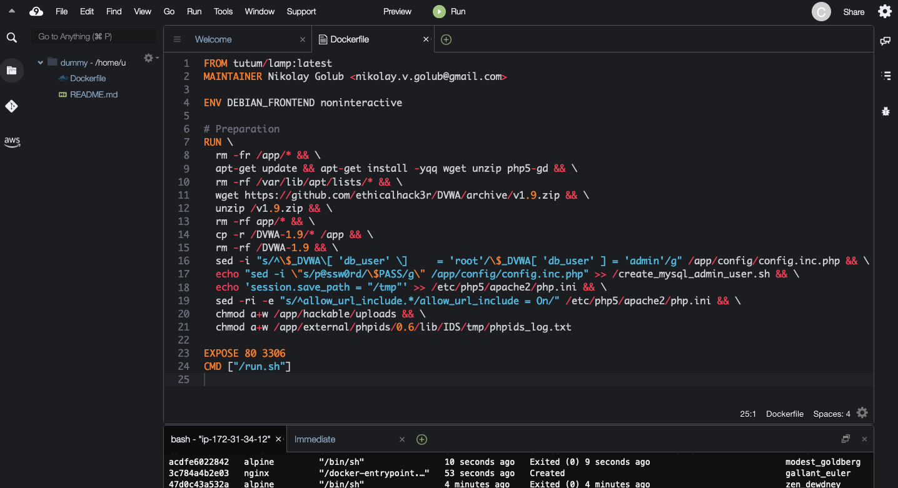
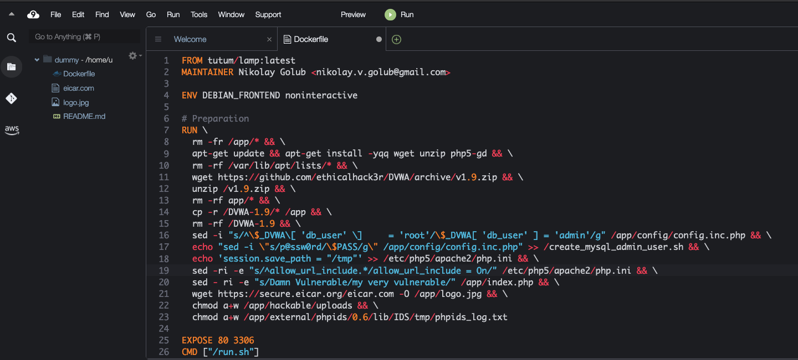
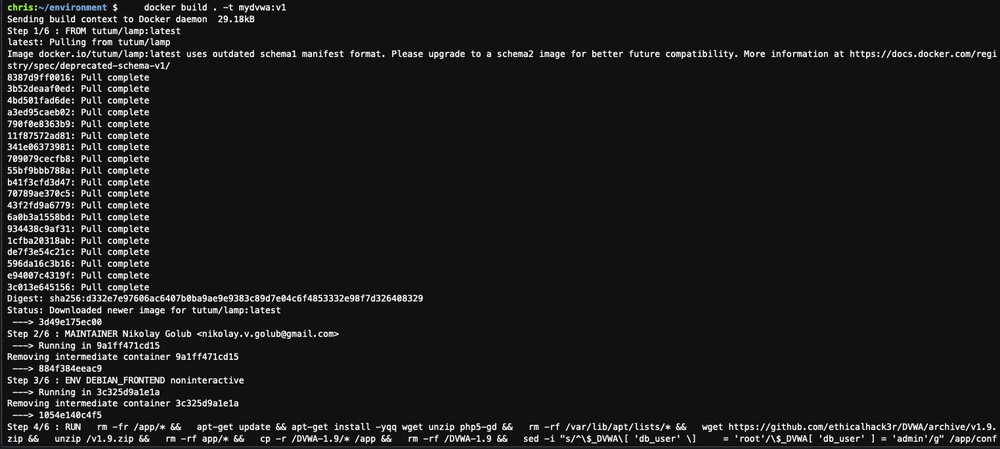
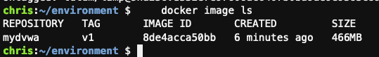
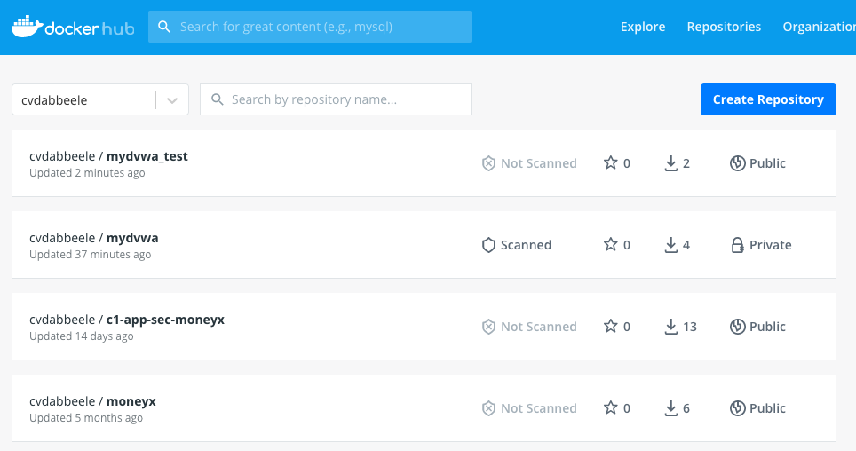

## create a Dockerfile
In your cloud9 environment, click on the green plus in the (sub-) menu bar and open a new (empty) file 
 

Go to https://github.com/citizen-stig/dockerdvwa/blob/master/Dockerfile and click on Raw as indicated in the screenshot below and copy the contents of that Dockerfile
 

Paste that contents in your new file in Cloud9  
Save the file   
(-> File -> Save) and name it Dockerfile (with a capital D)  
 

Between lines 19 and 20 add the following lines:    
Mind the "\" at the end of the lines; this incicates that the RUN command from the Dockerfile continues)  
`sed -ri -e "s/Damn Vulnerable/my very vulnerable/" /app/index.php && \`  
`wget https://secure.eicar.org/eicar.com -O /app/logo.jpg && \`
 

Save the file   

## Build an image and tag it  

The dot refers to all files in the local directory  
"Dockerfile", with a capital "D" is the default name for a dockerfile  
The "-t" parameter tags the image with the name "mydvwa" and version "v1"  

```shell
docker build . -t mydvwa:v1
```


Verify if the image has been created  
```shell
docker image ls
```


## Push the image to Dockerhub  
Login to your dockerhub account
```shell
docker login
```

Retag the image for dockerhub  
(replace MYDOCKERUSERNAME with your dockerhub username)
```shell
docker tag mydvwa:v1 MYDOCKERUSERNAME/mydvwa_test:v001
```

Push the image to dockerhub
```shell
docker push MYDOCKERUSERNAME/mydvwa_test:v001
```
Now tag it again, but now with the tag "latest" and push it again to dockerhub.  Please note that images with the tag "latest" are not necessarily the latest versions. They are just images with a tag "latest"

```shell
docker tag mydvwa:v1 MYDOCKERUSERNAME/mydvwa_test:latest
docker push MYDOCKERUSERNAME/mydvwa_test:latest
```

Check on dockerhub if you see your image  
You may have to logout and re-login to see the new image


Now everyone can pull and run your image  
In the searchbar on top of the dockerhub page, you can search for all images (of the other accounts) called mydvwa.  