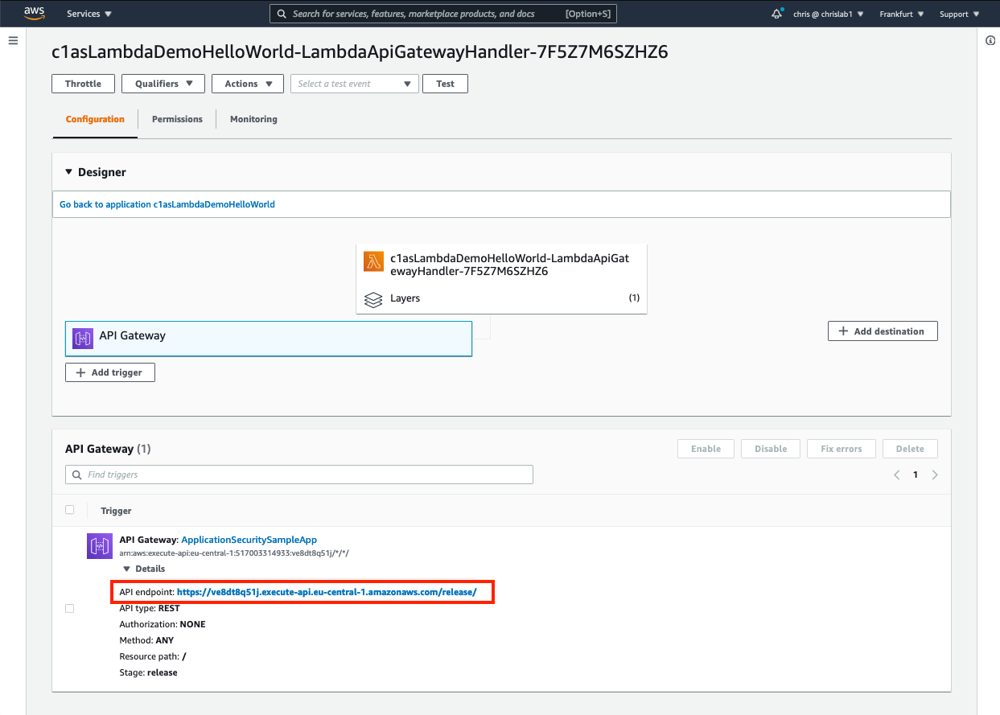

#   HOW TO DEMO
## Preparation:  
- find the URL of your API endpoint by clicking on `API gateway` section in your Lambda function, as indicated in the screenshot below, and then expanding the `Details` header.    Keep in mind that the first time that you trigger this Lambda function, it may take a few extra seconds.  This is because AWS has to deploy a container for the function to run in.  
- ensure the C1AS policies are all in REPORT mode
- test by going to <URL>/release?file=/etc/passwd   
  
## Demo:
(MicroAgent is in reporting mode)  
Go to the URL that is exposed by your lambda function and:  
  1. upload eicar  (you will need an endpoint without an AntiVirus agent if you want to demo this)
  2. use (preferably) Google Chrome and go to: `<URL>/release?file=/etc/passwd`  This will dump the /etc/passwd password file.

Block the attack:
  - In C1AS, set the "File Access" to MITIGATE
  - The file access will hit the error handler for the custom response
  - Refresh the `Hello World` page.  You should now get a (pretty minimalistic) blocking page

PS: this Lambda does not show the C1AS Block page.  If access is blocked, it always returns "Blocked" (which is hardcoded in the Lambda-Python script)  

PS/2: the error page throws an error in Firefox.  It works fine in Google Chrome
  

